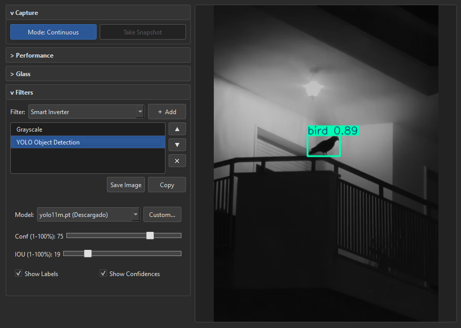
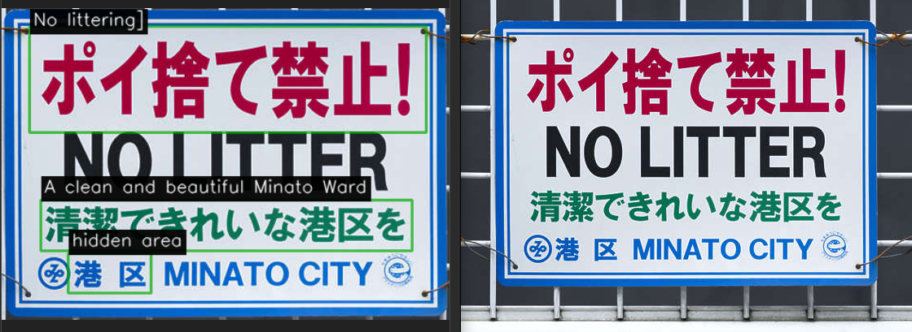
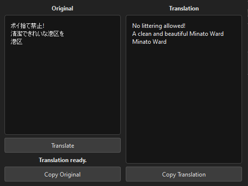

# GlassCV

GlassCV is a high-performance desktop application focused on real-time screen capture, processing, and AI-powered analysis. It is built using Python, PyQt6, OpenCV, and deep learning frameworks (YOLO, EasyOCR), with a primary focus on low latency and GPU-accelerated processing.

## Key Features

- **Dual Window Architecture**: 
  - **Glass Overlay**: A transparent, draggable, and resizable overlay that allows you to select the exact region of the screen you want to capture.
  - **Control Panel**: A dedicated interface to manage captures, configure filters, and control AI models without interfering with your viewing area.
- **Ultra-fast Screen Capture**: Uses `mss` for the best performance and lowest latency in screen capturing, ensuring a continuous stream.
- **Multithreaded Processing**: Image capture and processing are performed in separate background threads (multithreading) to prevent any UI lag.
- **HiDPI Support**: Advanced support for screens with different DPI scales, ensuring that capture coordinates are accurate across any monitor configuration.
- **Real-time Image Processing & Filter Chain**: Apply and chain various built-in OpenCV filters (e.g., Grayscale, Canny Edges, RGB Mixer, Colorblind Simulation, Smart Inverter) directly from the Control Panel.
- **Template Matching & Object Counting**: Use a dedicated "Template Glass" window to capture a visual template and perform real-time object detection and counting within the main capture region.
- **YOLO Object Detection**: Real-time object detection powered by Ultralytics YOLO, with GPU acceleration (CUDA). Features include:
  - Dynamic model selector with auto-download — choose from YOLO11 (Nano to XLarge) and YOLOv8 (Nano to Medium) directly from a dropdown menu.
  - Models are automatically downloaded the first time they are selected and stored in the `models/` directory.
  - The dropdown clearly indicates which models are already downloaded (`Descargado`).
  - Support for loading custom-trained `.pt` models via a file dialog.
  - Adjustable Confidence and IOU thresholds, with toggles for showing labels and confidence scores on detections.
- **EasyOCR Text Recognition**: Real-time text detection and recognition using EasyOCR with GPU acceleration. Features include:
  - Built-in throttling mechanism (max 2 FPS) to maintain a smooth video feed while performing OCR.
  - Adjustable confidence threshold and language selection.
  - Configurable OCR overlay with toggles for text, boxes, confidence scores, and text background.
  - Independent styling for text, detection boxes, and text background, including color, thickness, opacity, and padding controls.
  - Translation workflow with target language selection, overlay text source selection, and a Translate action.
- **GPU Acceleration**: Full NVIDIA CUDA support via PyTorch. AI models (YOLO and EasyOCR) automatically detect and utilize your GPU for maximum performance.

## Technologies Used

- **Python >= 3.11**
- **PyQt6**: For GUI development and advanced window management.
- **OpenCV (`opencv-python`)**: For processing captured images.
- **MSS (`mss`)**: For extremely low-latency, cross-platform screen capture.
- **NumPy**: For efficient manipulation of pixel matrices and image data.
- **Ultralytics (`ultralytics`)**: For YOLO object detection models.
- **EasyOCR (`easyocr`)**: For optical character recognition (text detection).
- **PyTorch (`torch`) with CUDA**: Deep learning backend with GPU acceleration.

## Installation

1. Clone the repository:
   ```bash
   git clone https://github.com/AdrianCervantes53/GlassCV.git
   cd GlassCV
   ```

2. (Recommended) Ensure you have an active virtual environment. The project uses a `pyproject.toml` and `uv.lock` file for dependency management. You can create a virtual environment and install dependencies using `uv` or `pip`:

   **Using `uv` (recommended):**
   ```bash
   uv sync
   ```

   **Using `pip`:**
   ```bash
   python -m venv .venv
   # On Windows:
   .venv\Scripts\activate
   # Install dependencies
   pip install -e .
   ```

3. **(Optional) Enable GPU Acceleration**: By default, `pip install` installs the CPU-only version of PyTorch. To enable CUDA support for your NVIDIA GPU, reinstall PyTorch with the appropriate CUDA index:
   ```bash
   pip install torch torchvision torchaudio --index-url https://download.pytorch.org/whl/cu121 --upgrade --force-reinstall
   ```

## Usage

To run the application, execute the main script located in the `src` directory:

```bash
python src/main.py
```

Upon launching, the following main windows will open:
1. The **Control Panel**: From here you can control the workflow, configure filter chains, select AI models, and manage options.
2. The **Glass Window**: Drag and resize this transparent box over the specific area of your screen that you wish to capture and analyze.

*Note: A third **Template Glass** window can be toggled from the Control Panel to capture specific visual templates for the Object Counter filter.*

## App Preview


### Using YOLO Object Detection

1. In the Filter Chain section, select **YOLO Object Detection** from the dropdown and click **＋ Add**.
2. Choose a model from the **Model** dropdown (e.g., `yolo11n.pt`). If the model hasn't been downloaded yet, it will be fetched automatically on first use.
3. Adjust the **Confidence** and **IOU** sliders to fine-tune detection sensitivity.
4. Toggle **Show Labels** and **Show Confidences** to control what information is displayed on detections.
5. To use a custom-trained model, click **Custom...** and select your `.pt` file.

### Control Panel with YOLO Object Detection



### Using EasyOCR Text Recognition

1. In the Filter Chain section, select **EasyOCR Text Recognition** from the dropdown and click **＋ Add**.
2. Select the target **Language** from the dropdown.
3. Adjust the **Confidence** slider to filter out low-confidence text detections.
4. Use the **Overlay** section to show or hide text, boxes, confidence scores, and text backgrounds.
5. Customize text, detection boxes, and background styling from their respective subsections.
6. Use the **Translation** section to select the target language, choose whether the overlay uses original or translated text, and run **Translate**.

### Glass Overlay with OCR and translation



### OCR with Translation Panel



## Project Structure

- `src/`
  - `main.py`: Main entry point of the application.
  - `ui/`: Modules containing the GUI logic (ControlWindow and GlassWindow).
    - `widgets/`: Reusable UI widgets, such as collapsible configuration sections.
  - `core/`: Core logic, screen capture via `mss`, background thread image processing, AI model integration, geometry calculations, etc.
- `models/`: Directory where YOLO model weights (`.pt` files) are stored. Models are automatically downloaded here when selected for the first time.
- `pyproject.toml`: Project configuration and dependencies.
- `.gitignore`: Exclusion rules to prevent uploading temporary files, binaries, and virtual environments to the repository.

## Roadmap
- Multi-monitor management improvements.
- Exporting and importing functionality for custom filter chains.
- Asynchronous model downloading with progress indicator in the UI.
